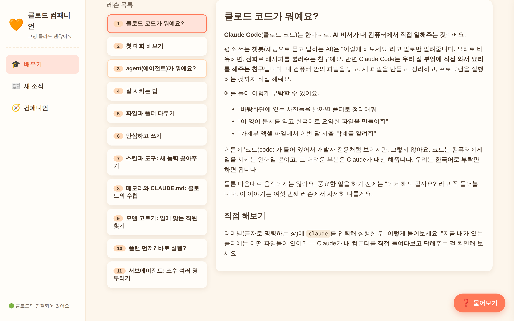
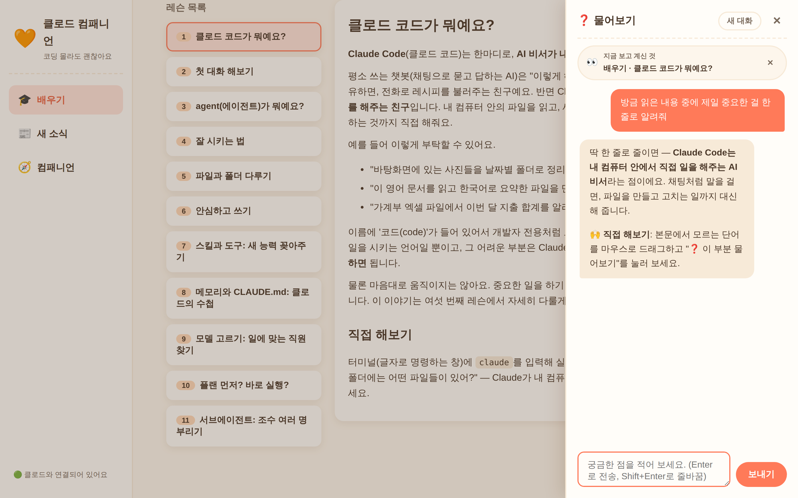
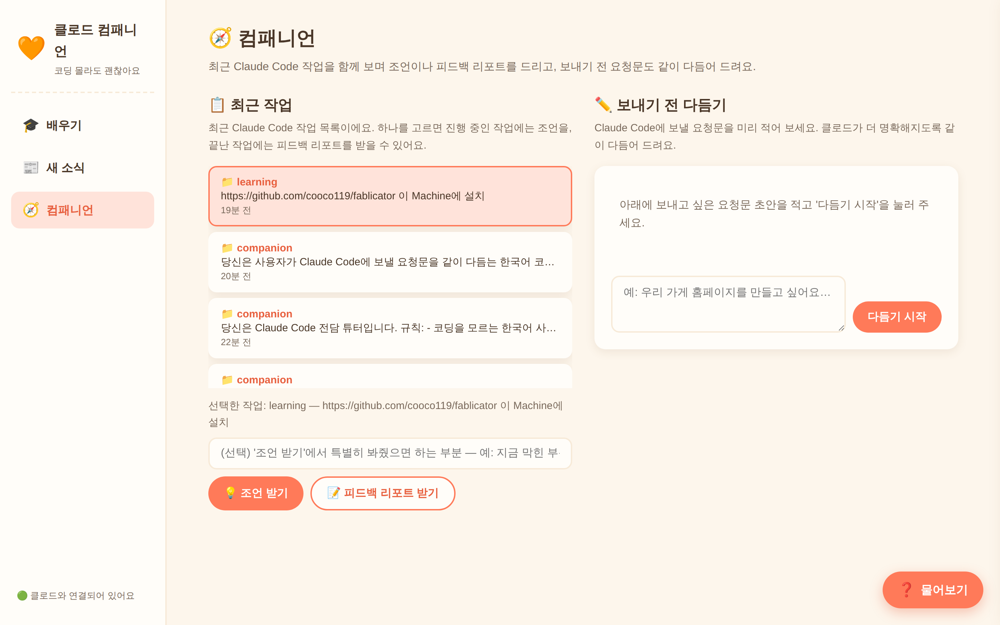

# Claude Companion (클로드 컴패니언)

> 코딩을 전혀 몰라도 괜찮아요. 이 앱은 여러분이 **Claude Code**(클로드 코드 — 내 컴퓨터에서 직접 일을 해주는 AI 비서)를 처음 만나고, 배우고, 잘 쓰게 도와주는 친절한 안내자입니다.

혹시 "AI한테 일을 시킬 수 있다던데, 나는 컴퓨터를 잘 몰라서…"라고 생각해 보신 적 있나요? 바로 그런 분을 위해 만들었습니다. 이 앱은 여러분의 컴퓨터 안에서만 조용히 돌아가는 작은 웹사이트예요. 어려운 명령어를 외울 필요 없이, 평소 쓰던 인터넷 브라우저(크롬, 사파리 같은 것) 화면에서 클릭하고 글을 쓰면 됩니다.

안에는 이런 것들이 들어 있어요. 차근차근 따라 읽을 수 있는 **배우기** 레슨, 매일의 클로드 소식을 쉬운 한국어로 모아 보는 **새 소식**, 일을 더 잘 시키도록 옆에서 코치해 주는 **컴패니언**(companion — '동반자'라는 뜻), 그리고 어느 화면에서든 궁금한 게 생기면 바로 누르는 **❓ 물어보기** 버튼입니다. 천천히, 본인 속도대로 시작해 보세요. 🌱

## 시작하기 3단계

### ① 기본 설정 — 가입, Claude Code 설치, 로그인

먼저 AI 비서인 Claude Code를 쓸 수 있는 상태로 만들어야 해요. 크게 세 가지입니다.

1. **가입** — [claude.ai](https://claude.ai) 에서 Claude 계정을 만들어요 (구글 계정이나 이메일이면 충분해요). Claude Code를 쓰려면 유료 구독(Pro 또는 Max)이 필요합니다.
2. **설치** — 터미널에서 한 줄로 Claude Code를 설치해요. macOS는 `curl -fsSL https://claude.ai/install.sh | bash`, Windows는 PowerShell에서 `irm https://claude.ai/install.ps1 | iex` 입니다. (이 앱을 위해 Node.js도 설치해요 — 가이드에서 함께 안내합니다.)
3. **로그인** — 터미널에서 `claude` 를 실행하면 브라우저가 열리며 로그인을 안내해 줘요. 한 번만 하면 컴퓨터가 기억합니다.

처음이라면 아래 가이드를 그대로 따라 하시면 됩니다. '터미널이 뭐예요?'부터 시작하니 걱정 마세요.

👉 [docs/getting-started.md — 처음부터 끝까지 따라하는 설치 가이드](docs/getting-started.md)

### ② 이 앱 설치하기

이 단계에서는 `git`(깃)이라는 도구를 사용해요. 먼저 git이 컴퓨터에 있는지 확인해 봅시다. 터미널(글자로 컴퓨터에 명령을 내리는 창)을 열고 아래를 입력해 보세요.

```bash
git --version
```

`git version 2.x.x` 처럼 숫자가 나오면 이미 설치된 거예요. 다음으로 넘어가세요. 만약 에러가 나면(예: "용어가 인식되지 않습니다", "command not found") 아래처럼 git을 먼저 설치하세요.

- **Windows**: 브라우저에서 [https://git-scm.com/download/win](https://git-scm.com/download/win) 을 열어 설치 파일을 내려받고, 설치 화면에서 계속 "Next"를 눌러 기본 설정 그대로 설치하세요. 설치가 끝나면 **터미널 창을 닫았다가 다시 열고** 위의 `git --version`으로 확인하세요.
- **macOS(맥)**: 터미널에 `git` 이라고 입력하면 "명령어 라인 개발자 도구(Command Line Tools)를 설치하시겠습니까?"라는 창이 뜰 수 있어요. **"설치"를 눌러 주세요.** 몇 분 걸릴 수 있고, 끝나면 git도 함께 설치됩니다.

git이 준비됐으면, 아래 세 줄을 **한 줄씩** 복사해서 붙여넣고 Enter(엔터)를 누르세요. (한 줄 입력하고 Enter, 끝나면 다음 줄 — 이 순서예요. 특히 Windows의 기본 PowerShell에서는 두 명령을 `&&`로 이어 붙이면 에러가 나니 꼭 한 줄씩 실행하세요.)

```bash
git clone https://github.com/cooco119/claude-companion.git
cd claude-companion
npm install
```

- `git clone`은 "이 앱을 인터넷에서 내 컴퓨터로 내려받기"라는 뜻이에요.
- `cd claude-companion`은 "방금 내려받은 폴더 안으로 이동하기"예요.
- `npm install`은 "앱이 돌아가는 데 필요한 부품들을 자동으로 챙겨오기"입니다.

### ③ 앱 켜고 브라우저로 열기

같은 터미널 창에서 아래 한 줄을 입력하고 Enter를 누르세요.

```bash
npm start
```

그 다음, 평소 쓰는 브라우저 주소창에 이렇게 입력하면 끝입니다.

```
http://localhost:3456
```

`localhost`(로컬호스트)는 "내 컴퓨터 자신"이라는 뜻이에요. 즉 이 앱은 인터넷에 공개되는 게 아니라, 내 컴퓨터 안에서만 열리는 나만의 페이지입니다.

## 화면 구성

앱을 열면 왼쪽에 세 개의 탭(메뉴)이 보이고, 화면 오른쪽 아래에는 어디서든 누를 수 있는 물음표 버튼이 떠 있습니다.

| 탭 / 버튼 | 무엇을 하는 곳인가요? |
|---|---|
| 🎓 **배우기** | 비개발자 눈높이로 쓴 한국어 레슨을 차례대로 읽는 곳이에요. "클로드 코드가 뭐예요?"부터 시작합니다. |
| 📰 **새 소식** | 최신 Claude·Claude Code 소식을 쉬운 한국어 요약으로 모아 보는 곳이에요. 소식마다 "이게 나에게 왜 좋은가" 한 줄이 함께 붙어 있어서, 뉴스를 몰라도 흐름을 따라갈 수 있어요. |
| 🧭 **컴패니언** | 최근 Claude Code 작업을 읽고 조언이나 다른 관점을 들려주고, 끝난 작업에 대해서는 **피드백 리포트**("이번에 잘하신 점과, 다음엔 이렇게 말해보세요" 식의 따뜻한 돌아보기)를 만들어 주며, AI에게 보낼 요청문을 보내기 전에 같이 다듬어 주는 코치입니다. |
| ❓ **물어보기** | 어느 화면에서든 우하단 물음표 버튼 — 보던 내용을 알고 답해주는 튜터, 글자를 드래그해서 바로 물어볼 수도 있어요. |

실제 화면은 이렇게 생겼어요.

**🎓 배우기** — 레슨을 클릭해서 읽어요. 오른쪽 아래에 ❓ 물어보기 버튼이 항상 떠 있어요.



**❓ 물어보기** — ❓ 버튼을 누르면 오른쪽에 패널이 열려요. 보고 있던 화면 내용을 알고 답해 줘요.



**🧭 컴패니언** — 최근 작업 조언과 피드백 리포트, 보내기 전 다듬기.



## 문제 해결 FAQ

**Q1. 브라우저에 "사이트에 연결할 수 없음"이라고 떠요.**

앱이 아직 켜져 있지 않을 가능성이 커요. 터미널에서 `npm start`를 실행한 창이 열려 있는지 확인해 주세요. 그 창을 닫으면 앱도 함께 꺼집니다. 주소가 `http://localhost:3456` 인지도 다시 확인해 보세요(숫자 3456이 중요해요).

**Q2. 물어보기에서 질문을 보냈는데 에러가 나요. / "claude CLI를 찾을 수 없다"고 해요.**

AI 비서인 Claude Code가 아직 설치되지 않았거나 로그인이 안 된 상태일 수 있어요. [docs/getting-started.md](docs/getting-started.md)의 설치·로그인 단계를 다시 따라 해 보세요. 터미널에 `claude` 라고 입력했을 때 무언가 실행되면 설치는 된 것입니다.

**Q3. `npm start`를 했더니 "포트가 이미 사용 중"이라는 비슷한 에러가 나요.**

이미 앱이 한 번 켜져 있는 상태일 수 있어요. 먼저 브라우저에서 `http://localhost:3456` 을 열어 보세요. 이미 잘 열린다면 그대로 쓰시면 됩니다. 그래도 문제가 있다면 컴퓨터를 한 번 재시작한 뒤 `npm start`를 다시 실행해 보세요.

## 🤖 에이전트(AI)용 설치 가이드

> 이 절은 사람이 아니라 **AI 에이전트**(Claude Code 등)를 위한 것입니다. 사용자가 "이 앱 설치해줘"라고 시켰다면 아래를 그대로 따라 하세요. 사람이라면 위의 [시작하기 3단계](#시작하기-3단계)를 보시면 됩니다.

<!-- For agents: follow these steps verbatim. Each step includes its expected output for verification. -->

```bash
# 0. 사전 조건 확인
node --version    # v20 이상이어야 함. 없으면: 사용자에게 https://nodejs.org LTS 설치를 안내
git --version     # 없으면: OS에 맞게 git 설치 (macOS: xcode-select --install / Windows: git-scm.com)
claude --version  # 없으면 네이티브 설치(권장):
                  #   macOS/Linux/WSL: curl -fsSL https://claude.ai/install.sh | bash
                  #   Windows PowerShell: irm https://claude.ai/install.ps1 | iex
                  # 설치 후 로그인이 안 돼 있으면 사용자가 직접 `claude`를 실행해
                  # 브라우저 인증을 마치도록 안내해야 함 (에이전트가 대신 로그인할 수 없음)

# 1. 내려받기 + 설치
git clone https://github.com/cooco119/claude-companion.git
cd claude-companion
npm install       # 취약점 0, express + tsx + typescript 설치됨

# 2. 실행 (NO_OPEN=1 은 headless 환경에서 브라우저 자동 열기를 끔)
NO_OPEN=1 npm start &   # 데스크톱 환경이면 NO_OPEN 없이 실행 — 브라우저가 자동으로 열림

# 3. 검증 (모두 통과해야 설치 성공)
curl -s http://localhost:3456/api/health
# 기대값: {"ok":true,"claudeCli":true}
#   claudeCli:false 면 → claude CLI 미설치/미로그인. 0번으로 돌아갈 것.
curl -s http://localhost:3456/api/lessons
# 기대값: lessons 배열 11개 (order 1~11)
```

검증까지 끝나면 사용자에게 **브라우저에서 `http://localhost:3456` 을 열라고 안내**하고, 첫 방문이라면 🎓 배우기 탭의 첫 레슨부터 읽기를 권하세요. 포트가 사용 중이면 `PORT=다른번호 npm start` 로 바꿔 실행하면 됩니다 (안내하는 주소도 같은 번호로).

## 라이선스

이 프로젝트는 MIT 라이선스(누구나 자유롭게 쓰고 고칠 수 있게 허락하는 약속)를 따릅니다. 자세한 내용은 [LICENSE](LICENSE) 파일을 참고하세요.
